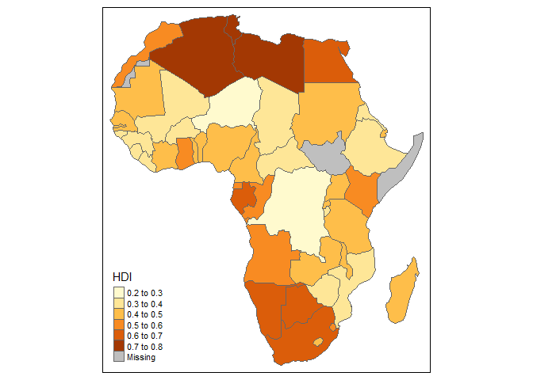
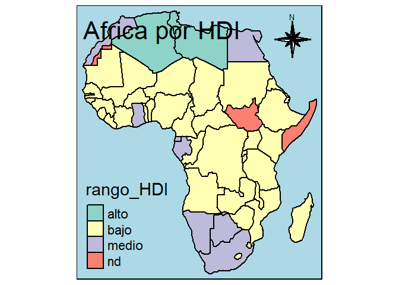
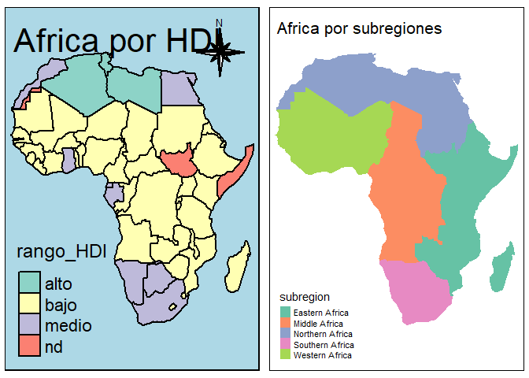

Lab 1
================
Óscar Agüero Rodriguez
30/8/2020

  - [1.3 Exercises](#exercises)
      - [1.3.1](#section)
      - [1.3.2](#section-1)
      - [1.3.3](#section-2)
      - [1.3.4](#section-3)
      - [1.3.5](#section-4)
  - [2.6 Exercices](#exercices)
      - [2.6.1](#section-5)
      - [2.6.2](#section-6)
      - [2.6.3](#section-7)
  - [4.4 Exercises](#exercises-1)
      - [4.4.1](#section-8)
      - [4.4.2](#section-9)
      - [4.4.3](#section-10)
      - [4.4.4](#section-11)
  - [6.6 Exercises](#exercises-2)
      - [6.6.1](#section-12)
      - [6.6.2](#section-13)
      - [6.6.3](#section-14)
      - [6.6.4](#section-15)
      - [6.6.5](#section-16)
      - [6.6.6](#section-17)
      - [6.6.7](#section-18)
  - [8.7 Exercises](#exercises-3)
      - [8.7.1](#section-19)
      - [8.7.2](#section-20)
      - [8.7.3](#section-21)
      - [8.7.4](#section-22)
      - [8.7.5](#section-23)
      - [8.7.6](#section-24)
      - [8.7.7](#section-25)

Paquetes a utilizar

``` r
suppressPackageStartupMessages(library(tidyverse))
suppressPackageStartupMessages(library(sf))
suppressPackageStartupMessages(library(mapview))
suppressPackageStartupMessages(library(abind))
suppressPackageStartupMessages(library(stars))
suppressPackageStartupMessages(library(RSQLite))
suppressPackageStartupMessages(library(spacetime))
suppressPackageStartupMessages(library(xts))
suppressPackageStartupMessages(library(starsdata))
suppressPackageStartupMessages(library(spData))
suppressPackageStartupMessages(library(spDataLarge))
suppressPackageStartupMessages(library(units))
suppressPackageStartupMessages(library(cubelyr))
suppressPackageStartupMessages(library(tmap))
```

# 1.3 Exercises

## 1.3.1

Read the shapefile storms\_xyz\_feature from the shape directory in the
sf package

``` r
tst = st_read(system.file("shape/storms_xyz_feature.shp", package="sf"), quiet = TRUE)
class(st_geometry(tst))
```

    ## [1] "sfc_LINESTRING" "sfc"

``` r
class(st_geometry(tst)[[1]])
```

    ## [1] "XYZ"        "LINESTRING" "sfg"

## 1.3.2

Copy this file to another directory on your computer, and read it from
there (note: a shapefile consists of more than one file\!)

``` r
setwd("~/Estadística/Spacial Stats/Storms_xyz")
tst1 <- st_read("storms_xyz_feature.shp")
```

    ## Reading layer `storms_xyz_feature' from data source `C:\Users\Oscar\Documents\Estadística\Spacial Stats\Storms_xyz\storms_xyz_feature.shp' using driver `ESRI Shapefile'
    ## Simple feature collection with 71 features and 1 field
    ## geometry type:  LINESTRING
    ## dimension:      XYZ
    ## bbox:           xmin: -102.2 ymin: 8.3 xmax: 0 ymax: 59.5
    ## z_range:        zmin: 924 zmax: 1017
    ## CRS:            NA

## 1.3.3

How many features does this dataset contain?

``` r
tst1
```

    ## Simple feature collection with 71 features and 1 field
    ## geometry type:  LINESTRING
    ## dimension:      XYZ
    ## bbox:           xmin: -102.2 ymin: 8.3 xmax: 0 ymax: 59.5
    ## z_range:        zmin: 924 zmax: 1017
    ## CRS:            NA
    ## First 10 features:
    ##      Track                       geometry
    ## 1     TONY LINESTRING Z (-50.8 20.1 10...
    ## 2    SANDY LINESTRING Z (-77.4 14.3 10...
    ## 3   RAFAEL LINESTRING Z (-62.7 14.7 10...
    ## 4    PATTY LINESTRING Z (-72.5 25.5 10...
    ## 5    OSCAR LINESTRING Z (-38 12.4 1008...
    ## 6   NADINE LINESTRING Z (-38 15.5 1008...
    ## 7  MICHAEL LINESTRING Z (-36.7 28.9 10...
    ## 8   LESLIE LINESTRING Z (-27.4 12.9 10...
    ## 9     KIRK LINESTRING Z (-43.4 23.9 10...
    ## 10   JOYCE LINESTRING Z (-31.7 10.7 10...

Tiene 71 features

## 1.3.4

Plot the dataset, with axes = TRUE (hint: before plotting, pipe through
st\_zm to drop Z and M coordinates; more about this in chapter 3).

``` r
system.file("shape/storms_xyz_feature.shp", package="sf") %>%
  read_sf() %>%
  st_zm() %>% 
  plot(graticule = TRUE, axes = TRUE)
```

<!-- -->

## 1.3.5

Before plotting, pipe the dataset through st\_set\_crs(4326). What is
different in the plot obtained?

``` r
system.file("shape/storms_xyz_feature.shp", package="sf") %>%
  read_sf() %>%
  st_zm() %>% 
  st_set_crs(4326) %>% 
  plot(graticule = TRUE, axes = TRUE)
```

<!-- -->

La diferencia observada esta principalmente en las coordenadas del
plano, en el segunndo plano se pueden ver la dirección de los grados en
los margenes.

# 2.6 Exercices

## 2.6.1

Convert \((x , y)\) point (10,2), (-10,-2), (10,2) and (0,10) to polar
coordinates

Coordenada (10,2)

``` r
x1 <- 10; y1 <- 2
c1 <- sqrt(x1^2 + y1^2)
p1 <- atan(y1/x1)
copor1 <- cbind(c1, p1);copor1
```

    ##            c1        p1
    ## [1,] 10.19804 0.1973956

Coordenada (-10,-2)

``` r
x2 <- -10; y2 <- -2
c2 <- sqrt(x2^2 + y2^2)
p2 <- atan(y2/x2)
copor2 <- cbind(c2, p2);copor2
```

    ##            c2        p2
    ## [1,] 10.19804 0.1973956

Coordenada (10,-2)

``` r
x3 <- 10; y3 <- -2
c3 <- sqrt(x3^2 + y3^2)
p3 <- atan(y3/x3)
copor3 <- cbind(c3, p3);copor3
```

    ##            c3         p3
    ## [1,] 10.19804 -0.1973956

Coordenada (0,10)

``` r
x4 <- 0; y4 <- 10
c4 <- sqrt(x4^2 + y4^2)
p4 <- atan(y4/x4)
copor4 <- cbind(c4, p4);copor4
```

    ##      c4       p4
    ## [1,] 10 1.570796

## 2.6.2

Convert the polar \((r,\phi)\) points (10, 45°), (0,100°) and (5,359°)
to cartesian coordinates

``` r
r1 <- 10;phi1 <- 45
r2 <- 0; phi2 <- 100
r3 <- 5; phi3 <- 359

x_1 <- r1*cos(phi1)
y_1 <- r1*sin(phi1)

x_2 <- r2*cos(phi2)
y_2 <- r2*sin(phi2)

x_3 <- r3*cos(phi3)
y_3 <- r3*sin(phi3)

cc1 <- round(cbind(x_1,y_1),1)
cc2 <- round(cbind(x_2,y_2),1)
cc3 <- round(cbind(x_3,y_3),1)

resumen <- cbind(cc1, cc2, cc3)
resumen
```

    ##      x_1 y_1 x_2 y_2 x_3 y_3
    ## [1,] 5.3 8.5   0   0 3.3 3.8

## 2.6.3

Assuming the Earth is a sphere with a radius of 6371 km, compute for
\((\lambda, \phi)\) points the great circle distance between (10,10) and
(11,10), between (10,80) and (11,80), between (10,10) and (11,10) and
between (10,80) and (11,81) (units: degree): What the distance units?

Para dos punto \(p_1 = (\lambda_1, \phi_1)\) y
\(p_2 = (\lambda_2, \phi_2)\), donde \(p_1\) y \(p_2\) deben ser
calculados en radianes, se debe convertir primero los grados a Radianes.

Eso se realiza entendiendo que:

\[1° = \frac{\pi}{180}\]

Conversión

``` r
lambda1 <- 10*(pi/180)
theta1 <- 10*(pi/180)
lambda2 <- 11*(pi/180)
theta2 <- 10*(pi/180)

lambda3 <- 10*(pi/180)
theta3 <- 80*(pi/180)
lambda4 <- 11*(pi/180)
theta4 <- 80*(pi/180)

lambda5 <- 10*(pi/180)
theta5 <- 10*(pi/180)
lambda6 <- 10*(pi/180)
theta6 <- 11*(pi/180)

lambda7 <- 10*(pi/180)
theta7 <- 80*(pi/180)
lambda8 <- 10*(pi/180)
theta8 <- 81*(pi/180)

r <- 6371
```

Para obtener la distancia además, se debe aplicar la siguiente formulas
en esta secuencia

\[\theta_{12} = arccos(sin(\theta_1)*sin(\theta_2)+cos(\theta_1)*cos(\theta_2)cos(|\lambda_1 - \lambda_2|))\]

\[S_{12} = r*\theta_{12}\]

Distancia (1,2) entre arco (10,10) y (11,10)

``` r
theta12 <- acos(sin(theta1)*sin(theta2)+cos(theta1)*cos(theta2)*cos(abs(lambda1-lambda2)))
s12 <- r*theta12
s_12g <- (s12*180)/pi 

s12;s_12g
```

    ## [1] 109.5056

    ## [1] 6274.208

Distancia (3,4) entre arco (10,80) y (11,80)

``` r
theta34 <- acos(sin(theta3)*sin(theta4)+cos(theta3)*cos(theta4)*cos(abs(lambda3-lambda4)))
s34 <- r*theta34
s_34g <- (s34*180)/pi 

s34;s_34g
```

    ## [1] 19.30856

    ## [1] 1106.299

Distancia (5,6) entre arco (10,10) y (10,11)

``` r
theta56 <- acos(sin(theta5)*sin(theta6)+cos(theta5)*cos(theta6)*cos(abs(lambda5-lambda6)))
s56 <- r*theta56
s_56g <- (s56*180)/pi 

s56;s_56g
```

    ## [1] 111.1949

    ## [1] 6371

Distancia (7,8) entre arco (10,80) y (10,81)

``` r
theta78 <- acos(sin(theta7)*sin(theta8)+cos(theta7)*cos(theta8)*cos(abs(lambda7-lambda8)))
s78 <- r*theta78
s_78g <- (s78*180)/pi 

s78;s_78g
```

    ## [1] 111.1949

    ## [1] 6371

# 4.4 Exercises

## 4.4.1

NDVI, normalized differenced vegetation index, is computed as
(NIR-R)/(NIR+R), with NIR the near infrared and R the red band. Read the
L7\_ETMs.tif file into object x, and distribute the band dimensions over
attributes by split(x,“band”). Then, compute NDVI by using a expression
that uses the NIR (band 4) and R (band 3) attributes directly.

``` r
tif = system.file("tif/L7_ETMs.tif", package = "stars")
x = read_stars(tif)
split(x,"band")
```

    ## stars object with 2 dimensions and 6 attributes
    ## attribute(s):
    ##       X1               X2               X3               X4         
    ##  Min.   : 47.00   Min.   : 32.00   Min.   : 21.00   Min.   :  9.00  
    ##  1st Qu.: 67.00   1st Qu.: 55.00   1st Qu.: 49.00   1st Qu.: 52.00  
    ##  Median : 78.00   Median : 66.00   Median : 63.00   Median : 63.00  
    ##  Mean   : 79.15   Mean   : 67.57   Mean   : 64.36   Mean   : 59.24  
    ##  3rd Qu.: 89.00   3rd Qu.: 79.00   3rd Qu.: 77.00   3rd Qu.: 75.00  
    ##  Max.   :255.00   Max.   :255.00   Max.   :255.00   Max.   :255.00  
    ##       X5               X6         
    ##  Min.   :  1.00   Min.   :  1.00  
    ##  1st Qu.: 63.00   1st Qu.: 32.00  
    ##  Median : 89.00   Median : 60.00  
    ##  Mean   : 83.18   Mean   : 59.98  
    ##  3rd Qu.:112.00   3rd Qu.: 88.00  
    ##  Max.   :255.00   Max.   :255.00  
    ## dimension(s):
    ##   from  to  offset delta                       refsys point values    
    ## x    1 349  288776  28.5 UTM Zone 25, Southern Hem... FALSE   NULL [x]
    ## y    1 352 9120761 -28.5 UTM Zone 25, Southern Hem... FALSE   NULL [y]

``` r
ndvi = function(x) (x[4]-x[3])/(x[4]+x[3])
st_apply(x, c("x", "y"), ndvi)
```

    ## stars object with 2 dimensions and 1 attribute
    ## attribute(s):
    ##      ndvi          
    ##  Min.   :-0.75342  
    ##  1st Qu.:-0.20301  
    ##  Median :-0.06870  
    ##  Mean   :-0.06432  
    ##  3rd Qu.: 0.18667  
    ##  Max.   : 0.58667  
    ## dimension(s):
    ##   from  to  offset delta                       refsys point values    
    ## x    1 349  288776  28.5 UTM Zone 25, Southern Hem... FALSE   NULL [x]
    ## y    1 352 9120761 -28.5 UTM Zone 25, Southern Hem... FALSE   NULL [y]

## 4.4.2

Compute NDVI for the S2 image, using st\_apply and an function ndvi =
function(x) (x\[4\]-x\[3\])/(x\[4\]+x\[3\]). Plot the result, and write
the result to a GeoTIFF. Explian the difference in runtime between
plotting and writing.

``` r
ndvi = function(x) (x[4]-x[3])/(x[4]+x[3])
y <- st_apply(x, c("x", "y"), ndvi)
y
```

    ## stars object with 2 dimensions and 1 attribute
    ## attribute(s):
    ##      ndvi          
    ##  Min.   :-0.75342  
    ##  1st Qu.:-0.20301  
    ##  Median :-0.06870  
    ##  Mean   :-0.06432  
    ##  3rd Qu.: 0.18667  
    ##  Max.   : 0.58667  
    ## dimension(s):
    ##   from  to  offset delta                       refsys point values    
    ## x    1 349  288776  28.5 UTM Zone 25, Southern Hem... FALSE   NULL [x]
    ## y    1 352 9120761 -28.5 UTM Zone 25, Southern Hem... FALSE   NULL [y]

Plotting and writting as GeoTIFF

``` r
tf = tempfile(fileext=".tif")
write_stars(y, tf)
st_drivers("raster")
```

    ##                                    name
    ## VRT                                 VRT
    ## DERIVED                         DERIVED
    ## GTiff                             GTiff
    ## NITF                               NITF
    ## RPFTOC                           RPFTOC
    ## ECRGTOC                         ECRGTOC
    ## HFA                                 HFA
    ## SAR_CEOS                       SAR_CEOS
    ## CEOS                               CEOS
    ## JAXAPALSAR                   JAXAPALSAR
    ## GFF                                 GFF
    ## ELAS                               ELAS
    ## AIG                                 AIG
    ## AAIGrid                         AAIGrid
    ## GRASSASCIIGrid           GRASSASCIIGrid
    ## SDTS                               SDTS
    ## DTED                               DTED
    ## PNG                                 PNG
    ## JPEG                               JPEG
    ## MEM                                 MEM
    ## JDEM                               JDEM
    ## GIF                                 GIF
    ## BIGGIF                           BIGGIF
    ## ESAT                               ESAT
    ## FITS                               FITS
    ## BSB                                 BSB
    ## XPM                                 XPM
    ## BMP                                 BMP
    ## DIMAP                             DIMAP
    ## AirSAR                           AirSAR
    ## RS2                                 RS2
    ## SAFE                               SAFE
    ## PCIDSK                           PCIDSK
    ## PCRaster                       PCRaster
    ## ILWIS                             ILWIS
    ## SGI                                 SGI
    ## SRTMHGT                         SRTMHGT
    ## Leveller                       Leveller
    ## Terragen                       Terragen
    ## GMT                                 GMT
    ## netCDF                           netCDF
    ## HDF4                               HDF4
    ## HDF4Image                     HDF4Image
    ## ISIS3                             ISIS3
    ## ISIS2                             ISIS2
    ## PDS                                 PDS
    ## PDS4                               PDS4
    ## VICAR                             VICAR
    ## TIL                                 TIL
    ## ERS                                 ERS
    ## JP2OpenJPEG                 JP2OpenJPEG
    ## L1B                                 L1B
    ## FIT                                 FIT
    ## GRIB                               GRIB
    ## JPEG2000                       JPEG2000
    ## RMF                                 RMF
    ## WCS                                 WCS
    ## WMS                                 WMS
    ## MSGN                               MSGN
    ## RST                                 RST
    ## INGR                               INGR
    ## GSAG                               GSAG
    ## GSBG                               GSBG
    ## GS7BG                             GS7BG
    ## COSAR                             COSAR
    ## TSX                                 TSX
    ## COASP                             COASP
    ## R                                     R
    ## MAP                                 MAP
    ## KMLSUPEROVERLAY         KMLSUPEROVERLAY
    ## WEBP                               WEBP
    ## PDF                                 PDF
    ## Rasterlite                   Rasterlite
    ## MBTiles                         MBTiles
    ## PLMOSAIC                       PLMOSAIC
    ## CALS                               CALS
    ## WMTS                               WMTS
    ## SENTINEL2                     SENTINEL2
    ## MRF                                 MRF
    ## PNM                                 PNM
    ## DOQ1                               DOQ1
    ## DOQ2                               DOQ2
    ## PAux                               PAux
    ## MFF                                 MFF
    ## MFF2                               MFF2
    ## FujiBAS                         FujiBAS
    ## GSC                                 GSC
    ## FAST                               FAST
    ## BT                                   BT
    ## LAN                                 LAN
    ## CPG                                 CPG
    ## IDA                                 IDA
    ## NDF                                 NDF
    ## EIR                                 EIR
    ## DIPEx                             DIPEx
    ## LCP                                 LCP
    ## GTX                                 GTX
    ## LOSLAS                           LOSLAS
    ## NTv1                               NTv1
    ## NTv2                               NTv2
    ## CTable2                         CTable2
    ## ACE2                               ACE2
    ## SNODAS                           SNODAS
    ## KRO                                 KRO
    ## ROI_PAC                         ROI_PAC
    ## RRASTER                         RRASTER
    ## BYN                                 BYN
    ## ARG                                 ARG
    ## RIK                                 RIK
    ## USGSDEM                         USGSDEM
    ## GXF                                 GXF
    ## BAG                                 BAG
    ## HDF5                               HDF5
    ## HDF5Image                     HDF5Image
    ## NWT_GRD                         NWT_GRD
    ## NWT_GRC                         NWT_GRC
    ## ADRG                               ADRG
    ## SRP                                 SRP
    ## BLX                                 BLX
    ## PostGISRaster             PostGISRaster
    ## SAGA                               SAGA
    ## IGNFHeightASCIIGrid IGNFHeightASCIIGrid
    ## XYZ                                 XYZ
    ## HF2                                 HF2
    ## OZI                                 OZI
    ## CTG                                 CTG
    ## E00GRID                         E00GRID
    ## ZMap                               ZMap
    ## NGSGEOID                       NGSGEOID
    ## IRIS                               IRIS
    ## PRF                                 PRF
    ## RDA                                 RDA
    ## EEDAI                             EEDAI
    ## DAAS                               DAAS
    ## SIGDEM                           SIGDEM
    ## GPKG                               GPKG
    ## CAD                                 CAD
    ## PLSCENES                       PLSCENES
    ## NGW                                 NGW
    ## GenBin                           GenBin
    ## ENVI                               ENVI
    ## EHdr                               EHdr
    ## ISCE                               ISCE
    ## HTTP                               HTTP
    ##                                                                       long_name
    ## VRT                                                              Virtual Raster
    ## DERIVED                              Derived datasets using VRT pixel functions
    ## GTiff                                                                   GeoTIFF
    ## NITF                                       National Imagery Transmission Format
    ## RPFTOC                                         Raster Product Format TOC format
    ## ECRGTOC                                                         ECRG TOC format
    ## HFA                                                 Erdas Imagine Images (.img)
    ## SAR_CEOS                                                         CEOS SAR Image
    ## CEOS                                                                 CEOS Image
    ## JAXAPALSAR                           JAXA PALSAR Product Reader (Level 1.1/1.5)
    ## GFF                    Ground-based SAR Applications Testbed File Format (.gff)
    ## ELAS                                                                       ELAS
    ## AIG                                                        Arc/Info Binary Grid
    ## AAIGrid                                                     Arc/Info ASCII Grid
    ## GRASSASCIIGrid                                                 GRASS ASCII Grid
    ## SDTS                                                                SDTS Raster
    ## DTED                                                      DTED Elevation Raster
    ## PNG                                                   Portable Network Graphics
    ## JPEG                                                                  JPEG JFIF
    ## MEM                                                            In Memory Raster
    ## JDEM                                                        Japanese DEM (.mem)
    ## GIF                                          Graphics Interchange Format (.gif)
    ## BIGGIF                                       Graphics Interchange Format (.gif)
    ## ESAT                                                       Envisat Image Format
    ## FITS                                            Flexible Image Transport System
    ## BSB                                                 Maptech BSB Nautical Charts
    ## XPM                                                           X11 PixMap Format
    ## BMP                                        MS Windows Device Independent Bitmap
    ## DIMAP                                                                SPOT DIMAP
    ## AirSAR                                                AirSAR Polarimetric Image
    ## RS2                                                      RadarSat 2 XML Product
    ## SAFE                                                Sentinel-1 SAR SAFE Product
    ## PCIDSK                                                     PCIDSK Database File
    ## PCRaster                                                   PCRaster Raster File
    ## ILWIS                                                          ILWIS Raster Map
    ## SGI                                                   SGI Image File Format 1.0
    ## SRTMHGT                                                     SRTMHGT File Format
    ## Leveller                                                   Leveller heightfield
    ## Terragen                                                   Terragen heightfield
    ## GMT                                                      GMT NetCDF Grid Format
    ## netCDF                                               Network Common Data Format
    ## HDF4                                         Hierarchical Data Format Release 4
    ## HDF4Image                                                          HDF4 Dataset
    ## ISIS3                                   USGS Astrogeology ISIS cube (Version 3)
    ## ISIS2                                   USGS Astrogeology ISIS cube (Version 2)
    ## PDS                                                  NASA Planetary Data System
    ## PDS4                                               NASA Planetary Data System 4
    ## VICAR                                                           MIPL VICAR file
    ## TIL                                                             EarthWatch .TIL
    ## ERS                                                      ERMapper .ers Labelled
    ## JP2OpenJPEG                          JPEG-2000 driver based on OpenJPEG library
    ## L1B                                        NOAA Polar Orbiter Level 1b Data Set
    ## FIT                                                                   FIT Image
    ## GRIB                                               GRIdded Binary (.grb, .grb2)
    ## JPEG2000            JPEG-2000 part 1 (ISO/IEC 15444-1), based on Jasper library
    ## RMF                                                        Raster Matrix Format
    ## WCS                                                    OGC Web Coverage Service
    ## WMS                                                         OGC Web Map Service
    ## MSGN                                             EUMETSAT Archive native (.nat)
    ## RST                                                           Idrisi Raster A.1
    ## INGR                                                          Intergraph Raster
    ## GSAG                                          Golden Software ASCII Grid (.grd)
    ## GSBG                                         Golden Software Binary Grid (.grd)
    ## GS7BG                                      Golden Software 7 Binary Grid (.grd)
    ## COSAR                                COSAR Annotated Binary Matrix (TerraSAR-X)
    ## TSX                                                          TerraSAR-X Product
    ## COASP                                           DRDC COASP SAR Processor Raster
    ## R                                                           R Object Data Store
    ## MAP                                                            OziExplorer .MAP
    ## KMLSUPEROVERLAY                                               Kml Super Overlay
    ## WEBP                                                                       WEBP
    ## PDF                                                              Geospatial PDF
    ## Rasterlite                                                           Rasterlite
    ## MBTiles                                                                 MBTiles
    ## PLMOSAIC                                                Planet Labs Mosaics API
    ## CALS                                                              CALS (Type 1)
    ## WMTS                                                   OGC Web Map Tile Service
    ## SENTINEL2                                                            Sentinel 2
    ## MRF                                                          Meta Raster Format
    ## PNM                                             Portable Pixmap Format (netpbm)
    ## DOQ1                                                       USGS DOQ (Old Style)
    ## DOQ2                                                       USGS DOQ (New Style)
    ## PAux                                                          PCI .aux Labelled
    ## MFF                                                           Vexcel MFF Raster
    ## MFF2                                                   Vexcel MFF2 (HKV) Raster
    ## FujiBAS                                                  Fuji BAS Scanner Image
    ## GSC                                                                 GSC Geogrid
    ## FAST                                                          EOSAT FAST Format
    ## BT                                          VTP .bt (Binary Terrain) 1.3 Format
    ## LAN                                                             Erdas .LAN/.GIS
    ## CPG                                                             Convair PolGASP
    ## IDA                                                     Image Data and Analysis
    ## NDF                                                           NLAPS Data Format
    ## EIR                                                           Erdas Imagine Raw
    ## DIPEx                                                                     DIPEx
    ## LCP                                           FARSITE v.4 Landscape File (.lcp)
    ## GTX                                                    NOAA Vertical Datum .GTX
    ## LOSLAS                                        NADCON .los/.las Datum Grid Shift
    ## NTv1                                                      NTv1 Datum Grid Shift
    ## NTv2                                                      NTv2 Datum Grid Shift
    ## CTable2                                                CTable2 Datum Grid Shift
    ## ACE2                                                                       ACE2
    ## SNODAS                                            Snow Data Assimilation System
    ## KRO                                                                   KOLOR Raw
    ## ROI_PAC                                                          ROI_PAC raster
    ## RRASTER                                                                R Raster
    ## BYN                                            Natural Resources Canada's Geoid
    ## ARG                                                   Azavea Raster Grid format
    ## RIK                                                     Swedish Grid RIK (.rik)
    ## USGSDEM                                      USGS Optional ASCII DEM (and CDED)
    ## GXF                                                GeoSoft Grid Exchange Format
    ## BAG                                                  Bathymetry Attributed Grid
    ## HDF5                                         Hierarchical Data Format Release 5
    ## HDF5Image                                                          HDF5 Dataset
    ## NWT_GRD                                 Northwood Numeric Grid Format .grd/.tab
    ## NWT_GRC                              Northwood Classified Grid Format .grc/.tab
    ## ADRG                                              ARC Digitized Raster Graphics
    ## SRP                                         Standard Raster Product (ASRP/USRP)
    ## BLX                                                        Magellan topo (.blx)
    ## PostGISRaster                                             PostGIS Raster driver
    ## SAGA                                    SAGA GIS Binary Grid (.sdat, .sg-grd-z)
    ## IGNFHeightASCIIGrid                     IGN France height correction ASCII Grid
    ## XYZ                                                           ASCII Gridded XYZ
    ## HF2                                                  HF2/HFZ heightfield raster
    ## OZI                                                      OziExplorer Image File
    ## CTG                                              USGS LULC Composite Theme Grid
    ## E00GRID                                                Arc/Info Export E00 GRID
    ## ZMap                                                             ZMap Plus Grid
    ## NGSGEOID                                            NOAA NGS Geoid Height Grids
    ## IRIS                                               IRIS data (.PPI, .CAPPi etc)
    ## PRF                                                         Racurs PHOTOMOD PRF
    ## RDA                                      DigitalGlobe Raster Data Access driver
    ## EEDAI                                               Earth Engine Data API Image
    ## DAAS                            Airbus DS Intelligence Data As A Service driver
    ## SIGDEM                                       Scaled Integer Gridded DEM .sigdem
    ## GPKG                                                                 GeoPackage
    ## CAD                                                              AutoCAD Driver
    ## PLSCENES                                                 Planet Labs Scenes API
    ## NGW                                                                 NextGIS Web
    ## GenBin                                           Generic Binary (.hdr Labelled)
    ## ENVI                                                         ENVI .hdr Labelled
    ## EHdr                                                         ESRI .hdr Labelled
    ## ISCE                                                                ISCE raster
    ## HTTP                                                      HTTP Fetching Wrapper
    ##                     write  copy is_raster is_vector   vsi
    ## VRT                  TRUE  TRUE      TRUE     FALSE  TRUE
    ## DERIVED             FALSE FALSE      TRUE     FALSE FALSE
    ## GTiff                TRUE  TRUE      TRUE     FALSE  TRUE
    ## NITF                 TRUE  TRUE      TRUE     FALSE  TRUE
    ## RPFTOC              FALSE FALSE      TRUE     FALSE  TRUE
    ## ECRGTOC             FALSE FALSE      TRUE     FALSE  TRUE
    ## HFA                  TRUE  TRUE      TRUE     FALSE  TRUE
    ## SAR_CEOS            FALSE FALSE      TRUE     FALSE  TRUE
    ## CEOS                FALSE FALSE      TRUE     FALSE  TRUE
    ## JAXAPALSAR          FALSE FALSE      TRUE     FALSE  TRUE
    ## GFF                 FALSE FALSE      TRUE     FALSE  TRUE
    ## ELAS                 TRUE FALSE      TRUE     FALSE  TRUE
    ## AIG                 FALSE FALSE      TRUE     FALSE  TRUE
    ## AAIGrid             FALSE  TRUE      TRUE     FALSE  TRUE
    ## GRASSASCIIGrid      FALSE FALSE      TRUE     FALSE  TRUE
    ## SDTS                FALSE FALSE      TRUE     FALSE  TRUE
    ## DTED                FALSE  TRUE      TRUE     FALSE  TRUE
    ## PNG                 FALSE  TRUE      TRUE     FALSE  TRUE
    ## JPEG                FALSE  TRUE      TRUE     FALSE  TRUE
    ## MEM                  TRUE FALSE      TRUE     FALSE FALSE
    ## JDEM                FALSE FALSE      TRUE     FALSE  TRUE
    ## GIF                 FALSE  TRUE      TRUE     FALSE  TRUE
    ## BIGGIF              FALSE FALSE      TRUE     FALSE  TRUE
    ## ESAT                FALSE FALSE      TRUE     FALSE  TRUE
    ## FITS                 TRUE FALSE      TRUE     FALSE FALSE
    ## BSB                 FALSE FALSE      TRUE     FALSE  TRUE
    ## XPM                 FALSE  TRUE      TRUE     FALSE  TRUE
    ## BMP                  TRUE FALSE      TRUE     FALSE  TRUE
    ## DIMAP               FALSE FALSE      TRUE     FALSE  TRUE
    ## AirSAR              FALSE FALSE      TRUE     FALSE  TRUE
    ## RS2                 FALSE FALSE      TRUE     FALSE  TRUE
    ## SAFE                FALSE FALSE      TRUE     FALSE  TRUE
    ## PCIDSK               TRUE FALSE      TRUE      TRUE  TRUE
    ## PCRaster             TRUE  TRUE      TRUE     FALSE FALSE
    ## ILWIS                TRUE  TRUE      TRUE     FALSE  TRUE
    ## SGI                  TRUE FALSE      TRUE     FALSE  TRUE
    ## SRTMHGT             FALSE  TRUE      TRUE     FALSE  TRUE
    ## Leveller             TRUE FALSE      TRUE     FALSE  TRUE
    ## Terragen             TRUE FALSE      TRUE     FALSE  TRUE
    ## GMT                 FALSE  TRUE      TRUE     FALSE FALSE
    ## netCDF               TRUE  TRUE      TRUE      TRUE FALSE
    ## HDF4                FALSE FALSE      TRUE     FALSE FALSE
    ## HDF4Image            TRUE FALSE      TRUE     FALSE FALSE
    ## ISIS3                TRUE  TRUE      TRUE     FALSE  TRUE
    ## ISIS2                TRUE FALSE      TRUE     FALSE  TRUE
    ## PDS                 FALSE FALSE      TRUE     FALSE  TRUE
    ## PDS4                 TRUE  TRUE      TRUE      TRUE  TRUE
    ## VICAR               FALSE FALSE      TRUE     FALSE  TRUE
    ## TIL                 FALSE FALSE      TRUE     FALSE  TRUE
    ## ERS                  TRUE FALSE      TRUE     FALSE  TRUE
    ## JP2OpenJPEG         FALSE  TRUE      TRUE      TRUE  TRUE
    ## L1B                 FALSE FALSE      TRUE     FALSE  TRUE
    ## FIT                 FALSE  TRUE      TRUE     FALSE  TRUE
    ## GRIB                FALSE  TRUE      TRUE     FALSE  TRUE
    ## JPEG2000            FALSE  TRUE      TRUE      TRUE  TRUE
    ## RMF                  TRUE FALSE      TRUE     FALSE  TRUE
    ## WCS                 FALSE FALSE      TRUE     FALSE  TRUE
    ## WMS                 FALSE  TRUE      TRUE     FALSE  TRUE
    ## MSGN                FALSE FALSE      TRUE     FALSE  TRUE
    ## RST                  TRUE  TRUE      TRUE     FALSE  TRUE
    ## INGR                 TRUE  TRUE      TRUE     FALSE  TRUE
    ## GSAG                FALSE  TRUE      TRUE     FALSE  TRUE
    ## GSBG                 TRUE  TRUE      TRUE     FALSE  TRUE
    ## GS7BG                TRUE  TRUE      TRUE     FALSE  TRUE
    ## COSAR               FALSE FALSE      TRUE     FALSE  TRUE
    ## TSX                 FALSE FALSE      TRUE     FALSE  TRUE
    ## COASP               FALSE FALSE      TRUE     FALSE FALSE
    ## R                   FALSE  TRUE      TRUE     FALSE  TRUE
    ## MAP                 FALSE FALSE      TRUE     FALSE  TRUE
    ## KMLSUPEROVERLAY     FALSE  TRUE      TRUE     FALSE  TRUE
    ## WEBP                FALSE  TRUE      TRUE     FALSE  TRUE
    ## PDF                  TRUE  TRUE      TRUE      TRUE FALSE
    ## Rasterlite          FALSE  TRUE      TRUE     FALSE  TRUE
    ## MBTiles              TRUE  TRUE      TRUE      TRUE  TRUE
    ## PLMOSAIC            FALSE FALSE      TRUE     FALSE FALSE
    ## CALS                FALSE  TRUE      TRUE     FALSE  TRUE
    ## WMTS                FALSE  TRUE      TRUE     FALSE  TRUE
    ## SENTINEL2           FALSE FALSE      TRUE     FALSE  TRUE
    ## MRF                  TRUE  TRUE      TRUE     FALSE  TRUE
    ## PNM                  TRUE FALSE      TRUE     FALSE  TRUE
    ## DOQ1                FALSE FALSE      TRUE     FALSE  TRUE
    ## DOQ2                FALSE FALSE      TRUE     FALSE  TRUE
    ## PAux                 TRUE FALSE      TRUE     FALSE  TRUE
    ## MFF                  TRUE  TRUE      TRUE     FALSE  TRUE
    ## MFF2                 TRUE  TRUE      TRUE     FALSE FALSE
    ## FujiBAS             FALSE FALSE      TRUE     FALSE  TRUE
    ## GSC                 FALSE FALSE      TRUE     FALSE  TRUE
    ## FAST                FALSE FALSE      TRUE     FALSE  TRUE
    ## BT                   TRUE FALSE      TRUE     FALSE  TRUE
    ## LAN                  TRUE FALSE      TRUE     FALSE  TRUE
    ## CPG                 FALSE FALSE      TRUE     FALSE  TRUE
    ## IDA                  TRUE FALSE      TRUE     FALSE  TRUE
    ## NDF                 FALSE FALSE      TRUE     FALSE  TRUE
    ## EIR                 FALSE FALSE      TRUE     FALSE  TRUE
    ## DIPEx               FALSE FALSE      TRUE     FALSE  TRUE
    ## LCP                 FALSE  TRUE      TRUE     FALSE  TRUE
    ## GTX                  TRUE FALSE      TRUE     FALSE  TRUE
    ## LOSLAS              FALSE FALSE      TRUE     FALSE  TRUE
    ## NTv1                FALSE FALSE      TRUE     FALSE  TRUE
    ## NTv2                 TRUE FALSE      TRUE     FALSE  TRUE
    ## CTable2              TRUE FALSE      TRUE     FALSE  TRUE
    ## ACE2                FALSE FALSE      TRUE     FALSE  TRUE
    ## SNODAS              FALSE FALSE      TRUE     FALSE  TRUE
    ## KRO                  TRUE FALSE      TRUE     FALSE  TRUE
    ## ROI_PAC              TRUE FALSE      TRUE     FALSE  TRUE
    ## RRASTER              TRUE  TRUE      TRUE     FALSE  TRUE
    ## BYN                  TRUE FALSE      TRUE     FALSE  TRUE
    ## ARG                 FALSE  TRUE      TRUE     FALSE  TRUE
    ## RIK                 FALSE FALSE      TRUE     FALSE  TRUE
    ## USGSDEM             FALSE  TRUE      TRUE     FALSE  TRUE
    ## GXF                 FALSE FALSE      TRUE     FALSE  TRUE
    ## BAG                 FALSE  TRUE      TRUE     FALSE  TRUE
    ## HDF5                FALSE FALSE      TRUE     FALSE  TRUE
    ## HDF5Image           FALSE FALSE      TRUE     FALSE  TRUE
    ## NWT_GRD              TRUE  TRUE      TRUE     FALSE  TRUE
    ## NWT_GRC             FALSE FALSE      TRUE     FALSE  TRUE
    ## ADRG                 TRUE FALSE      TRUE     FALSE  TRUE
    ## SRP                 FALSE FALSE      TRUE     FALSE  TRUE
    ## BLX                 FALSE  TRUE      TRUE     FALSE  TRUE
    ## PostGISRaster       FALSE  TRUE      TRUE     FALSE FALSE
    ## SAGA                 TRUE  TRUE      TRUE     FALSE  TRUE
    ## IGNFHeightASCIIGrid FALSE FALSE      TRUE     FALSE  TRUE
    ## XYZ                 FALSE  TRUE      TRUE     FALSE  TRUE
    ## HF2                 FALSE  TRUE      TRUE     FALSE  TRUE
    ## OZI                 FALSE FALSE      TRUE     FALSE  TRUE
    ## CTG                 FALSE FALSE      TRUE     FALSE  TRUE
    ## E00GRID             FALSE FALSE      TRUE     FALSE  TRUE
    ## ZMap                FALSE  TRUE      TRUE     FALSE  TRUE
    ## NGSGEOID            FALSE FALSE      TRUE     FALSE  TRUE
    ## IRIS                FALSE FALSE      TRUE     FALSE  TRUE
    ## PRF                 FALSE FALSE      TRUE     FALSE  TRUE
    ## RDA                 FALSE FALSE      TRUE     FALSE FALSE
    ## EEDAI               FALSE FALSE      TRUE     FALSE FALSE
    ## DAAS                FALSE FALSE      TRUE     FALSE FALSE
    ## SIGDEM              FALSE  TRUE      TRUE     FALSE  TRUE
    ## GPKG                 TRUE  TRUE      TRUE      TRUE  TRUE
    ## CAD                 FALSE FALSE      TRUE      TRUE  TRUE
    ## PLSCENES            FALSE FALSE      TRUE      TRUE FALSE
    ## NGW                  TRUE  TRUE      TRUE      TRUE FALSE
    ## GenBin              FALSE FALSE      TRUE     FALSE  TRUE
    ## ENVI                 TRUE FALSE      TRUE     FALSE  TRUE
    ## EHdr                 TRUE  TRUE      TRUE     FALSE  TRUE
    ## ISCE                 TRUE FALSE      TRUE     FALSE  TRUE
    ## HTTP                FALSE FALSE      TRUE      TRUE FALSE

``` r
plot(y)
```

<!-- -->

## 4.4.3

Use st\_transform to transform the stars object read from L7\_ETMs.tif
to EPSG 4326. Print the object. Is this a regular grid? Plot the first
band using arguments axes=TRUE and border=NA, and explain why this takes
such a long time.

``` r
tif = system.file("tif/L7_ETMs.tif", package = "stars")
x = read_stars(tif)
new = st_crs(4326)
y <- st_transform(x, new)
y
```

    ## stars object with 3 dimensions and 1 attribute
    ## attribute(s):
    ##   L7_ETMs.tif    
    ##  Min.   :  1.00  
    ##  1st Qu.: 54.00  
    ##  Median : 69.00  
    ##  Mean   : 68.91  
    ##  3rd Qu.: 86.00  
    ##  Max.   :255.00  
    ## dimension(s):
    ##      from  to offset delta refsys point                          values    
    ## x       1 349     NA    NA WGS 84 FALSE [349x352] -34.9165,...,-34.8261 [x]
    ## y       1 352     NA    NA WGS 84 FALSE  [349x352] -8.0408,...,-7.94995 [y]
    ## band    1   6     NA    NA     NA    NA                            NULL    
    ## curvilinear grid

``` r
plot(y, axes = TRUE, border =NA)
```

<!-- -->

Toma mucho tiempo porque los datos de tif/L7\_ETMs.tif son tipo raster y
al aplicarle una transformación le estamos cambiando a otro sistema de
coordenadas lo que genera perdida de datos.

## 4.4.4

Use st\_warp to warp the L7\_ETMs.tif object to EPSG 4326, and plot the
resulting object with axes=TRUE. Why is the plot created much faster
than after st\_transform?

``` r
tif <- system.file("tif/L7_ETMs.tif", package = "stars")
x <- read_stars(tif)
new_crs <- st_crs(4326)
y <- st_warp(x,crs = new_crs)
y
```

    ## stars object with 3 dimensions and 1 attribute
    ## attribute(s):
    ##   L7_ETMs.tif    
    ##  Min.   :  1.00  
    ##  1st Qu.: 54.00  
    ##  Median : 69.00  
    ##  Mean   : 68.93  
    ##  3rd Qu.: 86.00  
    ##  Max.   :255.00  
    ##  NA's   :8778    
    ## dimension(s):
    ##      from  to   offset        delta                       refsys point values
    ## x       1 350 -34.9166  0.000259243 +proj=longlat +datum=WGS8...    NA   NULL
    ## y       1 352 -7.94982 -0.000259243 +proj=longlat +datum=WGS8...    NA   NULL
    ## band    1   6       NA           NA                           NA    NA   NULL
    ##         
    ## x    [x]
    ## y    [y]
    ## band

``` r
plot(y, axes = TRUE)
```

<!-- -->

Se tiene mejor eficiencia comparado a utilizar st\_transform debido a
que no se le modifica el tipo de referencia de coordenada.

# 6.6 Exercises

## 6.6.1

Add a variable to the nc dataset by nc$State = “North Carolina”. Which
value should you attach to this variable for the attribute-geometry
relationship (agr)?

``` r
nc <- system.file("gpkg/nc.gpkg", package="sf") %>%
    read_sf() %>%
    st_transform(32119)

nc <- nc %>% 
  mutate(State = "North Carolina")
```

Se le debe ligar a una geometría de centroide, dado que no se cuenta con
una especifica para North Carolina, para esto se puede utilizar st\_agr

## 6.6.2

Create a new sf object from the geometry obtained by st\_union(nc), and
assign “North Carolina” to the variable State. Which agr can you now
assign to this attribute variable?

``` r
nc <- system.file("gpkg/nc.gpkg", package="sf") %>%
    read_sf() %>%
    st_transform(32119)
nc <- nc %>% 
  mutate(State = "North Carolina")
st_union(nc)
```

    ## Geometry set for 1 feature 
    ## geometry type:  MULTIPOLYGON
    ## dimension:      XY
    ## bbox:           xmin: 123829.8 ymin: 14740.06 xmax: 930518.6 ymax: 318255.5
    ## projected CRS:  NAD83 / North Carolina

    ## MULTIPOLYGON (((705428.2 49242.97, 705860.3 274...

``` r
nc1 <- nc %>% select(BIR74, SID74, NAME, State) %>%
    st_set_agr(c(BIR74 = "aggregate", SID74 = "aggregate", NAME = "identity", State = "identity"))
nc1
```

    ## Simple feature collection with 100 features and 4 fields
    ## Attribute-geometry relationship: 0 constant, 2 aggregate, 2 identity
    ## geometry type:  MULTIPOLYGON
    ## dimension:      XY
    ## bbox:           xmin: 123829.8 ymin: 14740.06 xmax: 930518.6 ymax: 318255.5
    ## projected CRS:  NAD83 / North Carolina
    ## # A tibble: 100 x 5
    ##    BIR74 SID74 NAME     State                                               geom
    ##    <dbl> <dbl> <chr>    <chr>                                 <MULTIPOLYGON [m]>
    ##  1  1091     1 Ashe     North Ca~ (((387344.7 278382.4, 381334.1 282769, 379438~
    ##  2   487     0 Allegha~ North Ca~ (((408601.4 292419.4, 408564.7 293980.2, 4066~
    ##  3  3188     5 Surry    North Ca~ (((478715.7 277484.2, 476934.3 278861, 471501~
    ##  4   508     1 Curritu~ North Ca~ (((878193.4 289118.8, 877381 291107.7, 875993~
    ##  5  1421     9 Northam~ North Ca~ (((769834.9 277787.4, 768364 274833.2, 762615~
    ##  6  1452     7 Hertford North Ca~ (((812327.7 277867.5, 791157.9 277003.1, 7898~
    ##  7   286     0 Camden   North Ca~ (((878193.4 289118.8, 883270.1 275304.7, 8811~
    ##  8   420     0 Gates    North Ca~ (((828444.5 290086.5, 824767.3 287156.9, 8208~
    ##  9   968     4 Warren   North Ca~ (((671746.3 278680.2, 674042.4 282229.8, 6704~
    ## 10  1612     1 Stokes   North Ca~ (((517435.1 277851.9, 479039 279092, 481101.2~
    ## # ... with 90 more rows

Dado que todos pertenencen al estado de North Carolina, solo se requiere
aplicar el valor “Identity” para asignar un valor unico a la geometria.

## 6.6.3

Use st\_area to add a variable with name area to nc. Compare the area
and AREA variables in the nc dataset. What are the units of AREA? Are
the two linearly related? If there are discrepancies, what could be the
cause?

``` r
nc$area <- st_area(nc)
nc1 <- head(cbind(nc$AREA, nc$area))
nc2 <- tail(cbind(nc$AREA, nc$area))
colnames(nc1) <- c("AREA", "area"); nc1
```

    ##       AREA       area
    ## [1,] 0.114 1137590142
    ## [2,] 0.061  611196991
    ## [3,] 0.143 1423728763
    ## [4,] 0.070  694661115
    ## [5,] 0.153 1520991764
    ## [6,] 0.097  967855261

``` r
colnames(nc2) <- c("AREA", "area"); nc2
```

    ##         AREA       area
    ##  [95,] 0.125 1263809410
    ##  [96,] 0.225 2288423548
    ##  [97,] 0.214 2180999120
    ##  [98,] 0.240 2450348999
    ##  [99,] 0.042  430718227
    ## [100,] 0.212 2166189958

Las unidades de AREA son muy similares a los de area, sin embargo, los
de AREA parecen que salieran de la división de area entre 10 millones.

Dado que ambas parecen tener los mismos valores, solo que una diferente
escala puede decirse que si hay linearidad. Sin embargo, cabe resaltar
que la similutud de los datos se da hasta el 3 decimal, ya que de ahí en
adelante si pareciera existir una discrepancia en los datos.

## 6.6.4

Is the area variable intensive or extensive? Is its agr equal to
constant, identity or aggregate?

En este caso se tiene un area por lo que se tiene que utilizar
extensive. Además, al ser una cantidad se debe utilizar el aggregate al
usar agr.

## 6.6.5

Find the name of the county that contains POINT(-78.34046 35.017)

``` r
nc <- system.file("gpkg/nc.gpkg", package="sf") %>%
    read_sf() %>%
    st_transform(4326)

punto <- st_point( c( -78.34046, 35.017 ) )
res <- st_contains(nc, punto)
```

    ## although coordinates are longitude/latitude, st_contains assumes that they are planar

``` r
res <- summary(res) 
res_1 <- as.numeric( res[,1])
pos <- which( res_1==1 )
nc$NAME[pos]
```

    ## [1] "Sampson"

El punto identificado es Sampson.

## 6.6.6

Find the names of all counties with boundaries that touch county Sampson

``` r
sampson_geo <- nc$geom[pos]

counties_2 <- st_intersection(nc, sampson_geo)
```

    ## although coordinates are longitude/latitude, st_intersection assumes that they are planar

    ## Warning: attribute variables are assumed to be spatially constant throughout all
    ## geometries

``` r
counties_2 <- counties_2[ counties_2$NAME!='Sampson',    ]; counties_2$NAME
```

    ## [1] "Johnston"   "Wayne"      "Harnett"    "Cumberland" "Duplin"    
    ## [6] "Bladen"     "Pender"

## 6.6.7

List the names of all counties that are less than 50 KM away from county
Sampson

``` r
counties_3 <- st_is_within_distance(nc, sampson_geo, dist = 50000)
counties_3 <- summary(counties_3) 
counties_3 <- as.numeric(counties_3[,1])
pos <- which( counties_3==1 )
nc$NAME[pos]
```

    ##  [1] "Wake"        "Chatham"     "Wilson"      "Johnston"    "Greene"     
    ##  [6] "Lee"         "Wayne"       "Harnett"     "Moore"       "Lenoir"     
    ## [11] "Sampson"     "Cumberland"  "Jones"       "Hoke"        "Duplin"     
    ## [16] "Onslow"      "Robeson"     "Bladen"      "Pender"      "Columbus"   
    ## [21] "New Hanover" "Brunswick"

# 8.7 Exercises

``` r
africa = world %>% 
   filter(continent == "Africa", !is.na(iso_a2)) %>% 
   left_join(worldbank_df, by = "iso_a2") %>% 
   dplyr::select(name, subregion, gdpPercap, HDI, pop_growth) %>% 
   st_transform("+proj=aea +lat_1=20 +lat_2=-23 +lat_0=0 +lon_0=25")
```

``` r
zion = st_read((system.file("vector/zion.gpkg", package = "spDataLarge")))
```

    ## Reading layer `zion' from data source `C:\Users\Oscar\Documents\R\win-library\4.0\spDataLarge\vector\zion.gpkg' using driver `GPKG'
    ## Simple feature collection with 1 feature and 11 fields
    ## geometry type:  POLYGON
    ## dimension:      XY
    ## bbox:           xmin: 302903.1 ymin: 4112244 xmax: 334735.5 ymax: 4153087
    ## projected CRS:  UTM Zone 12, Northern Hemisphere

``` r
data(nlcd, package = "spDataLarge")
```

## 8.7.1

Create a map showing the geographic distribution of the Human
Development Index (HDI) across Africa with base graphics (hint: use
plot()) and tmap packages (hint: use tm\_shape(africa) + …).

Usando plot()

``` r
plot(africa[4])
```

<!-- -->

Usando tm\_shape

``` r
tm_shape(africa)+ tm_polygons(col = "HDI")
```

<!-- -->

Ventaja 1: con tm\_shape la programación es similar a ggplot2 lo cual
permite tener claridad en lo que se quiere programar de manera lógica.

Ventaja 2: Al utilizar plot, no fue directo que se logra tener el mapa
deseado, primero tuve que probar hasta encontrar (esto no lo reflejo en
el código), con tm\_shape se puede hacer directo lo que se busca al
gráficar.

Otras formas de graficar pueden ser con ggplot2, cartogram y mapview
todas son librerias de R, por lo cual se pueden utilizar sin tener que
agregar costo a un trabajo o una investigación.

Bonus

Usando cartogram

``` r
library(cartogram)
africa_carto = cartogram_ncont(africa, "HDI")
tm_shape(africa_carto) + tm_polygons(col = "HDI")
```

<!-- -->

Usando ggplot2

``` r
g1 <- ggplot() + geom_sf(data = africa, aes(fill = HDI))
g1
```

<!-- -->

## 8.7.2

Extend the tmap created for the previous exercise so the legend has
three bins: “High” (HDI above 0.7), “Medium” (HDI between 0.55 and 0.7)
and “Low” (HDI below 0.55).

``` r
africa = africa %>% mutate(rango_HDI=case_when(HDI<0.55~'bajo',
                                               HDI>=0.55 & HDI<0.7  ~'medio',
                                               HDI>0.7 ~'alto',
                                               TRUE~'nd'))

map1 <- tm_shape(africa)+ tm_fill(col = "rango_HDI") + tm_borders(col = "black") + tm_layout(title = "Africa por HDI") + tm_layout(scale = 2) + tm_layout(bg.color = "lightblue") + tm_compass(type = "8star", position = c("right", "top"))

map1
```

<!-- -->

## 8.7.3

Represent africa’s subregions on the map. Change the default color
palette and legend title. Next, combine this map and the map created in
the previous exercise into a single plot.

``` r
map2 <- tm_shape(africa)+ tm_fill(col = "subregion", palette = "Set2") + tm_layout(title = "Africa por subregiones")
map2
```

<!-- -->

``` r
tmap_arrange(map1, map2)
```

<!-- -->

## 8.7.4

Create a land cover map of the Zion National Park.

Change the default colors to match your perception of the land cover
categories

Add a scale bar and north arrow and change the position of both to
improve the map’s aesthetic appeal

``` r
lc_colors <-  c("#476ba0", "#aa0000", "#b2ada3", "#68aa63", "#a58c30", "#c9c977", "#dbd83d", "#bad8ea")

zionmap <- tm_shape(nlcd) + tm_raster(style = "cont", palette = lc_colors, title = "Mapa de Cobertura terrestre") + 
  tm_shape(zion) + tm_borders(lwd = 3) +
  tm_layout(legend.frame = TRUE, legend.position = c(0.6, "top")) +
  tm_layout(frame.lwd = 4)

zionmap
```

    ## stars object downsampled to 888 by 1125 cells. See tm_shape manual (argument raster.downsample)

    ## Warning in rep(attr(shp[[1]], "colors"), length.out = length(lvls)): 'x' is NULL
    ## so the result will be NULL

<!-- -->

## 8.7.5

Create facet maps of countries in Eastern Africa: With one facet showing
HDI and the other representing population growth (hint: using variables
HDI and pop\_growth, respectively) With a ‘small multiple’ per country

``` r
eastern_africa = filter(africa, subregion == "Eastern Africa")
```

``` r
tm_shape(eastern_africa) +
  tm_polygons(col = c("HDI", "pop_growth"))
```

<!-- -->

``` r
tm_shape(eastern_africa) +
  tm_polygons("pop_growth", palette = "BuGn") +
  tm_facets(by = "name", drop.NA.facets = TRUE)
```

<!-- -->

## 8.7.6

Building on the previous facet map examples, create animated maps of
East Africa: Showing first the spatial distribution of HDI scores then
population growth Showing each country in order

``` r
#m = tm_shape(eastern_africa) +
  #tm_polygons(col = c("HDI", "pop_growth")) +
  #tm_facets(ncol = 1, nrow = 1)
#m

#tmap_animation(m, filename = "m.gif", width = 800, delay = 25)
#browseURL("m.gif")
```

Me da error porque no encuentra ImageMagick

Error in tmap\_animation(m, filename = “m.gif”, width = 800, delay = 25)
: Could not find ImageMagick. Make sure it is installed and included in
the systems PATH

## 8.7.7

Create an interactive map of Africa: With tmap With mapview With leaflet
Bonus: For each approach, add a legend (if not automatically provided)
and a scale bar

Con tmap

``` r
#tmap_mode("view")
#tm_shape(eastern_africa) +
  #tm_polygons("pop_growth")
```

con mapview

``` r
#mapview(eastern_africa, zcol = "pop_growth")
```

con leaflet

``` r
#library(leaflet)
#eastern_africa_1 <- st_transform(eastern_africa, 4326)
#pal = colorNumeric("RdYlBu", domain = eastern_africa_1$pop_growth)

#leaflet(data = eastern_africa_1) %>% 
  #addProviderTiles(providers$OpenStreetMap) %>%
   #addPolygons(fillColor = ~pal(pop_growth), fillOpacity = .8) %>% 
  #addLegend(pal = pal, values = ~pop_growth)
```
Laboratorio 1 versión final
