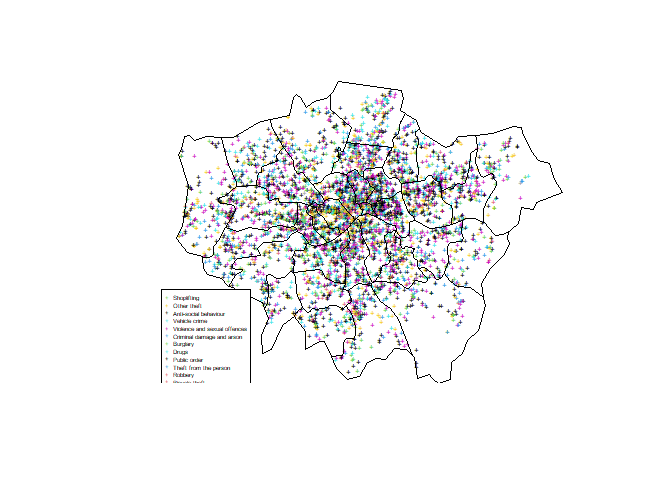
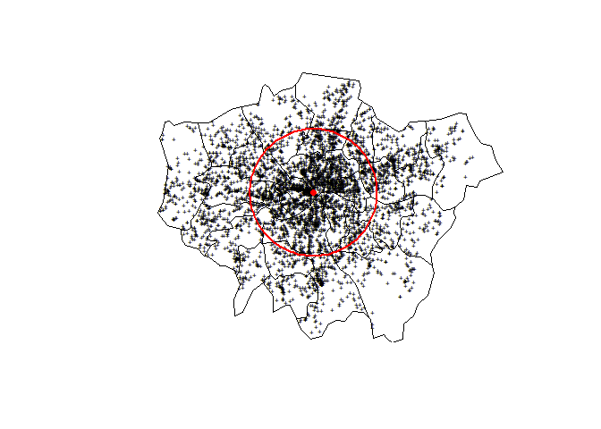
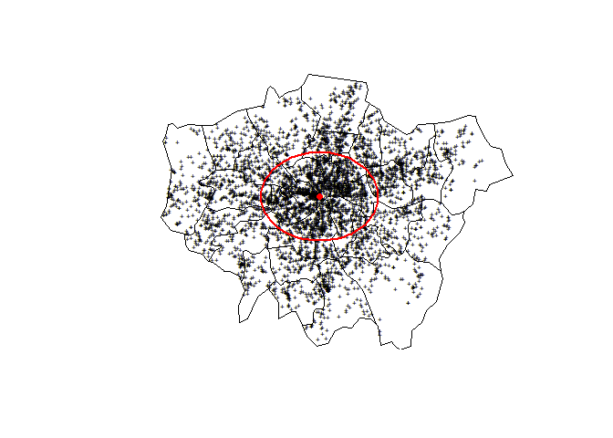
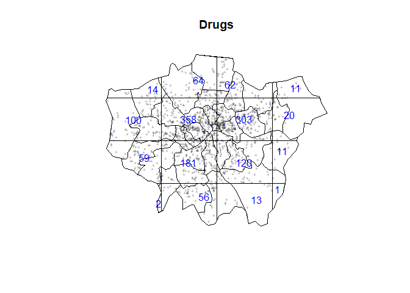
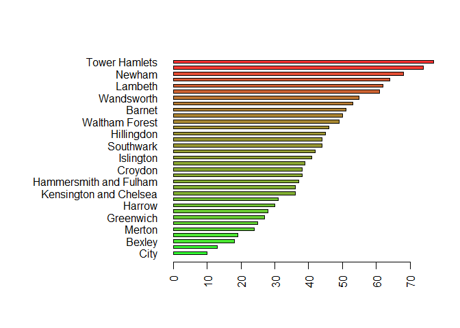
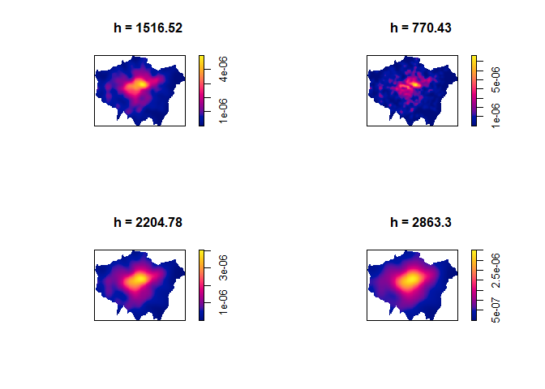
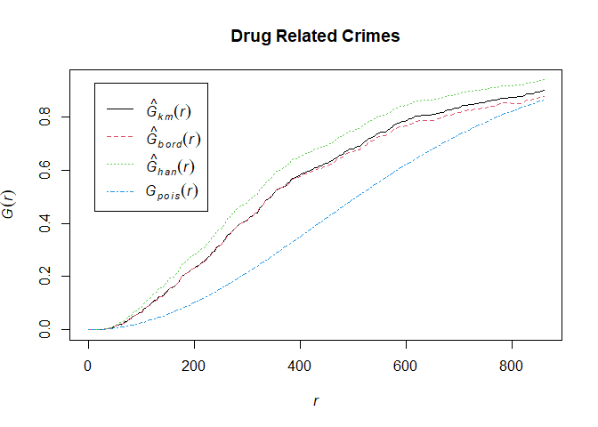

Laboratorio 2
================
Óscar Agüero Rodriguez
22/9/2020

  - [Laboratorio 2](#laboratorio-2)
      - [Paquetes a utilizar](#paquetes-a-utilizar)
      - [Carga de dataset](#carga-de-dataset)
      - [Point Pattern Analysis](#point-pattern-analysis)
      - [Working wwith spatstat](#working-wwith-spatstat)
      - [Conclusion](#conclusion)

# Laboratorio 2

## Paquetes a utilizar

``` r
library(starsdata)
library(tidyverse)
library(sf)
library(mapview)
library(stars)
library(RSQLite)
library(spacetime)
library(xts)
library(spDataLarge)
library(units)
library(cubelyr)
library(base)
library(nlme)
library(spatstat.data)
library(rpart)
library(spatstat)
library(raster)
library(plotrix)
library(maptools)
```

## Carga de dataset

Lectura de los datos a utilizar, son datos de la región de londres y su
contenido son crimes entre Mayo y Junio del año 2014.

``` r
setwd("~/Estadística/Spacial Stats")
data <- read.csv("london_street.csv", header = T, sep = ",")
data <- data[, 2:13]
str(data)
```

    ## 'data.frame':    5000 obs. of  12 variables:
    ##  $ Crime.ID             : chr  "a0feda8c2ab111cd313b875520387d493b14f82e546afd687e725737d667aa4a" "732d6aaa37de0db60aeb3814ccf7163bed49f5b6f717c4ebc3303c08c2022c8a" "985de970c47ec885ca30fc402db92a3efd64f1096c4aa2602af072ea2d012ce4" "" ...
    ##  $ Month                : chr  "2014-06" "2014-06" "2014-06" "2014-06" ...
    ##  $ Reported.by          : chr  "Metropolitan Police Service" "Metropolitan Police Service" "Metropolitan Police Service" "Metropolitan Police Service" ...
    ##  $ Falls.within         : chr  "Metropolitan Police Service" "Metropolitan Police Service" "Metropolitan Police Service" "Metropolitan Police Service" ...
    ##  $ Longitude            : num  -0.195 -0.111 -0.253 -0.106 -0.142 ...
    ##  $ Latitude             : num  51.4 51.4 51.5 51.4 51.4 ...
    ##  $ Location             : chr  "On or near High Street" "On or near Supermarket" "On or near Priests Bridge" "On or near Hood Close" ...
    ##  $ LSOA.code            : chr  "E01004140" "E01001005" "E01003857" "E01001013" ...
    ##  $ LSOA.name            : chr  "Sutton 012B" "Croydon 019A" "Richmond upon Thames 003F" "Croydon 020B" ...
    ##  $ Crime.type           : chr  "Shoplifting" "Shoplifting" "Other theft" "Anti-social behaviour" ...
    ##  $ Last.outcome.category: chr  "Offender given penalty notice" "Investigation complete; no suspect identified" "Investigation complete; no suspect identified" "" ...
    ##  $ Context              : logi  NA NA NA NA NA NA ...

Limpieza de los datos, principalmente en eliminar los NA’s del dataset.

``` r
data <- data[!is.na(data$Longitude)&!is.na(data$Latitude),]
```

## Point Pattern Analysis

Primero se define las coordenadas de la base en función de la longitud y
latitud del dataset. Se necesita resolver el problema de los duplicados,
ya que en el dataset se tiene dos crimenes en un mismo punto de
referencia, por ejemplo. Esto es necesario resolverlo antes de realizar
la proyección de los datos.

``` r
coordinates(data)=~Longitude+Latitude
zero <- zerodist(data)
length(unique(zero[,1]))
```

    ## [1] 585

Se descarga el archivo .shp

Nota: Se documenta la descarga y la extracción de los datos debido a que
ya se ejecuto 1 vez, no es necesario repetir el proceso para efectos de
este trabajo

``` r
#download.file("http://www.naturalearthdata.com/http//www.naturalearthdata.com/download/10m/cultural/ne_10m_admin_1_states_provinces.zip",destfile="ne_10m_admin_1_states_provinces.zip")

#unzip("ne_10m_admin_1_states_provinces.zip",exdir="NaturalEarth")

border <- shapefile("NaturalEarth/ne_10m_admin_1_states_provinces.shp")
```

Se extrae solo el poligono de Londres para efectos del trabajo de
crimes.

``` r
GreaterLondon <- border[paste(border$region)=="Greater London",]
```

se busca trasponer los datos de crimes de Londres con el poligono de
Londres, por lo que se requiere traslaparlos, eliminando primero
aquellos puntos que no estan dentro del poligono de Londres. Para lo
anterior se realiza la proyeccion de los datos con respecto a Londres,
de traslapan y se eliminan los Na’s

``` r
projection(data)=projection(border)
overlay <- over(data,GreaterLondon)
data$over <- overlay$adm1_code
data.London <- data[!is.na(data$over),]
summary(data.London$Crime.type)
```

    ##    Length     Class      Mode 
    ##      4955 character character

Se grafican los puntos proyectado para Londres sobre el poligono .shp,
en este gráfico solo vamos a obtener los puntos que quedaron dentro del
poligono, efecto de lo que se realizo en el chunk anterior.

``` r
plot(data.London,pch="+",cex=0.5,main="",col=as.factor(data.London$Crime.type))
plot(GreaterLondon,add=T)
legend(x=-0.53,y=51.41,pch="+",col=unique(as.factor(data.London$Crime.type)),legend=unique(data.London$Crime.type),cex=0.4)
```

<!-- -->

Calculo de estadísticas generales que utilizaran posterior

``` r
mean_centerX <- mean(data.London@coords[,1])
mean_centerY <- mean(data.London@coords[,2])

standard_deviationX <- sd(data.London@coords[,1])
standard_deviationY <- sd(data.London@coords[,2])

standard_distance <- sqrt(sum(((data.London@coords[,1]-mean_centerX)^2+(data.London@coords[,2]-mean_centerY)^2))/(nrow(data.London)))
```

Estos calculos se realizan para ver la concentración (meramente visual)
de los datos al rededor de la media o centro de un espacio geográfico,
con esto se puede graficar de tal manera que se pueda sobreponer un
circulo sobre el centro de los datos de toda la region de londres.

``` r
plot(data.London,pch="+",cex=0.5,main="")
plot(GreaterLondon,add=T)
points(mean_centerX,mean_centerY,col="red",pch=16)
draw.circle(mean_centerX,mean_centerY,radius=standard_distance,border="red",lwd=2)
```

<!-- --> Se puede
realizar de igual manera pero en lugar de un circulo, utilizar un
elipse.

``` r
plot(data.London,pch="+",cex=0.5,main="")
plot(GreaterLondon,add=T)
points(mean_centerX,mean_centerY,col="red",pch=16)
draw.ellipse(mean_centerX,mean_centerY,a=standard_deviationX,b=standard_deviationY,border="red",lwd=2)
```

<!-- -->

## Working wwith spatstat

Se seleccionan los datos de crimenes y se retiran los valores duplicados

``` r
Drugs <- data.London[data.London$Crime.type==unique(data.London$Crime.type)[3],]
Drugs <- remove.duplicates(Drugs)
summary(Drugs)
```

    ## Object of class SpatialPointsDataFrame
    ## Coordinates:
    ##                min      max
    ## Longitude -0.48389  0.24062
    ## Latitude  51.30014 51.67812
    ## Is projected: FALSE 
    ## proj4string : [+proj=longlat +datum=WGS84 +no_defs]
    ## Number of points: 1375
    ## Data attributes:
    ##    Crime.ID            Month           Reported.by        Falls.within      
    ##  Length:1375        Length:1375        Length:1375        Length:1375       
    ##  Class :character   Class :character   Class :character   Class :character  
    ##  Mode  :character   Mode  :character   Mode  :character   Mode  :character  
    ##    Location          LSOA.code          LSOA.name          Crime.type       
    ##  Length:1375        Length:1375        Length:1375        Length:1375       
    ##  Class :character   Class :character   Class :character   Class :character  
    ##  Mode  :character   Mode  :character   Mode  :character   Mode  :character  
    ##  Last.outcome.category Context            over          
    ##  Length:1375           Mode:logical   Length:1375       
    ##  Class :character      NA's:1375      Class :character  
    ##  Mode  :character                     Mode  :character

Se realiza la transformación de los datos empleando spTransform para
obtener un poligono espacial, en este caso la transformación se debe
realizar para la variable Drugs y los crimenes de Londres.

``` r
GreaterLondonUTM <- spTransform(GreaterLondon,CRS("+init=epsg:32630"))
Drugs.UTM <- spTransform(Drugs,CRS("+init=epsg:32630"))
```

Se transforma la variable GreaterLondonUTM a un objeto owin

``` r
window <- as.owin(GreaterLondonUTM)
```

La función “ppp” permite crear un objeto que representa un patro en los
datos de tal manera que se puedan poner en un plano de dos dimensiones.

``` r
Drugs.ppp <- ppp(x=Drugs.UTM@coords[,1],y=Drugs.UTM@coords[,2],window=window)
GreaterLondonUTM <- spTransform(GreaterLondon,CRS("+init=epsg:32630"))
```

Se realiza una divición con el fin de tener la intensidad de delitos
relacionados a las drogas.

``` r
Drugs.ppp$n/sum(sapply(slot(GreaterLondonUTM, "polygons"), slot, "area"))
```

    ## [1] 8.566451e-07

Se gráfica este índice representado por cuadrantes.

``` r
plot(Drugs.ppp,pch="+",cex=0.5,main="Drugs")
plot(quadratcount(Drugs.ppp, nx = 4, ny = 4),add=T,col="blue")
```

<!-- -->

En la siguiente iteración lo que se busca es extraer los datos de tal
manera que nos permita graficar los datos que se tienen a nivel del
polígono y poder graficar un gráfico distinto.

``` r
Local.Intensity <- data.frame(Borough=factor(),Number=numeric())

for(i in unique(GreaterLondonUTM$name)){
  sub.pol <- GreaterLondonUTM[GreaterLondonUTM$name==i,]
  
  sub.ppp <- ppp(x=Drugs.ppp$x,y=Drugs.ppp$y,window=as.owin(sub.pol))
  Local.Intensity <- rbind(Local.Intensity,data.frame(Borough=factor(i,levels=GreaterLondonUTM$name),Number=sub.ppp$n))
}
```

    ## Warning: 1320 points were rejected as lying outside the specified window

    ## Warning: 1351 points were rejected as lying outside the specified window

    ## Warning: 1301 points were rejected as lying outside the specified window

    ## Warning: 1339 points were rejected as lying outside the specified window

    ## Warning: 1329 points were rejected as lying outside the specified window

    ## Warning: 1325 points were rejected as lying outside the specified window

    ## Warning: 1338 points were rejected as lying outside the specified window

    ## Warning: 1350 points were rejected as lying outside the specified window

    ## Warning: 1365 points were rejected as lying outside the specified window

    ## Warning: 1298 points were rejected as lying outside the specified window

    ## Warning: 1337 points were rejected as lying outside the specified window

    ## Warning: 1324 points were rejected as lying outside the specified window

    ## Warning: 1326 points were rejected as lying outside the specified window

    ## Warning: 1339 points were rejected as lying outside the specified window

    ## Warning: 1362 points were rejected as lying outside the specified window

    ## Warning: 1357 points were rejected as lying outside the specified window

    ## Warning: 1347 points were rejected as lying outside the specified window

    ## Warning: 1330 points were rejected as lying outside the specified window

    ## Warning: 1314 points were rejected as lying outside the specified window

    ## Warning: 1345 points were rejected as lying outside the specified window

    ## Warning: 1322 points were rejected as lying outside the specified window

    ## Warning: 1334 points were rejected as lying outside the specified window

    ## Warning: 1313 points were rejected as lying outside the specified window

    ## Warning: 1331 points were rejected as lying outside the specified window

    ## Warning: 1337 points were rejected as lying outside the specified window

    ## Warning: 1333 points were rejected as lying outside the specified window

    ## Warning: 1331 points were rejected as lying outside the specified window

    ## Warning: 1356 points were rejected as lying outside the specified window

    ## Warning: 1307 points were rejected as lying outside the specified window

    ## Warning: 1348 points were rejected as lying outside the specified window

    ## Warning: 1311 points were rejected as lying outside the specified window

    ## Warning: 1344 points were rejected as lying outside the specified window

    ## Warning: 1336 points were rejected as lying outside the specified window

``` r
colorScale <- color.scale(Local.Intensity[order(Local.Intensity[,2]),2],color.spec="rgb",extremes=c("green","red"),alpha=0.8)

par(mar=c(5,13,4,2)) 
barplot(Local.Intensity[order(Local.Intensity[,2]),2],names.arg=Local.Intensity[order(Local.Intensity[,2]),1],horiz=T,las=2,space=1,col=colorScale)
```

<!-- -->

En este grafico podemos ver que la mayor concentración de casos se da en
la ciudad de Newham, seguido de Brent.

Este análisis se puede convinar empleando un suavizamiento de Kernel.
Para esto se puede utilizar la funciones bw.diggle, bww.ppl y bw.scott,
las cuales se usan para determinar como se comportan los datos según el
ancho de banda estimado.

``` r
par(mfrow=c(2,2))
plot(density.ppp(Drugs.ppp, sigma = bw.diggle(Drugs.ppp), edge = T), main = paste("h =", round(bw.diggle(Drugs.ppp), 2)))
plot(density.ppp(Drugs.ppp, sigma = bw.ppl(Drugs.ppp), edge = T), main = paste("h =", round(bw.ppl(Drugs.ppp), 2)))
plot(density.ppp(Drugs.ppp, sigma = bw.scott(Drugs.ppp)[2],edge=T), main = paste("h =", round(bw.scott(Drugs.ppp)[2], 2)))
plot(density.ppp(Drugs.ppp, sigma = bw.scott(Drugs.ppp)[1],edge = T), main = paste("h =",round(bw.scott(Drugs.ppp)[1], 2)))
```

<!-- -->

Por último, se puede obtener las curvas de distribución G, esta función
calcula la distribución de las distancias entre cada evento y su vecino
más cercano.

``` r
plot(Gest(Drugs.ppp),main="Drug Related Crimes")
```

<!-- -->

## Conclusion

Como parte del estudio realizado se puede ver como si hay agrupamiento
claro de casos en ciertos sectores donde se da una mayor concentración
de casos vinculados a crimenes ligados a drogas.

La menor cantidad de casos se dan en la perifería de Londres, y se
concentran más hacía el centro de la ciudad.
